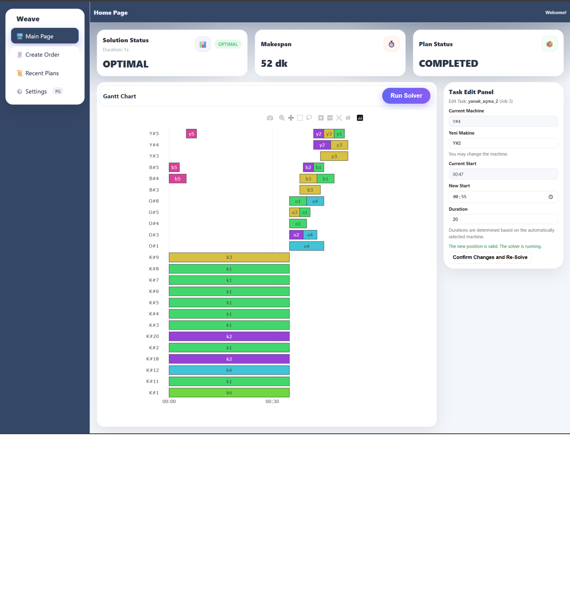
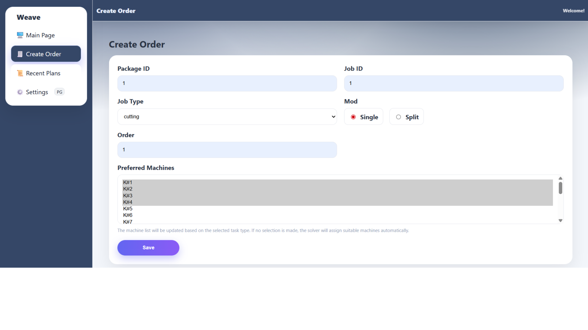
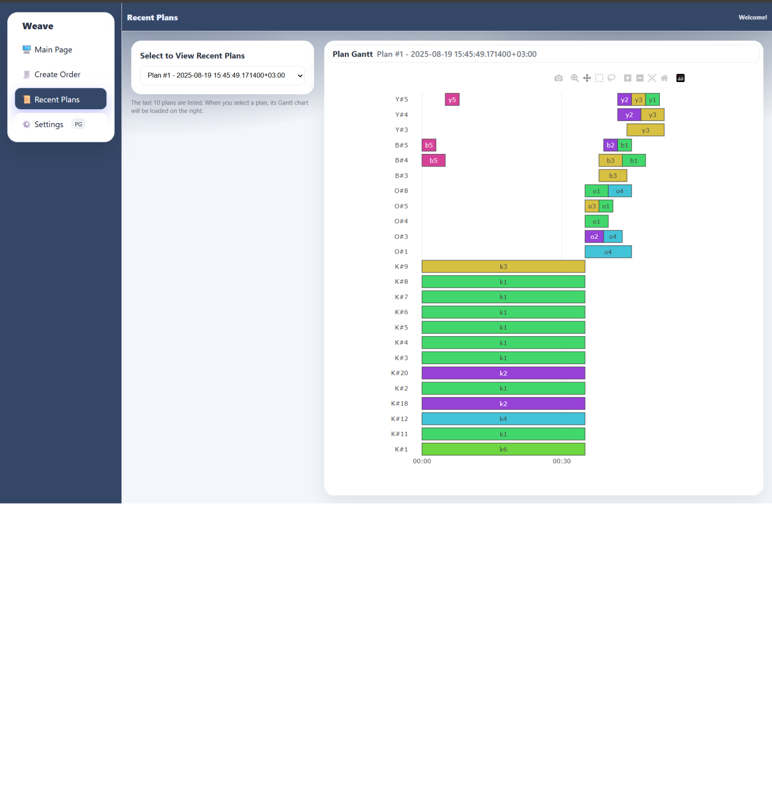
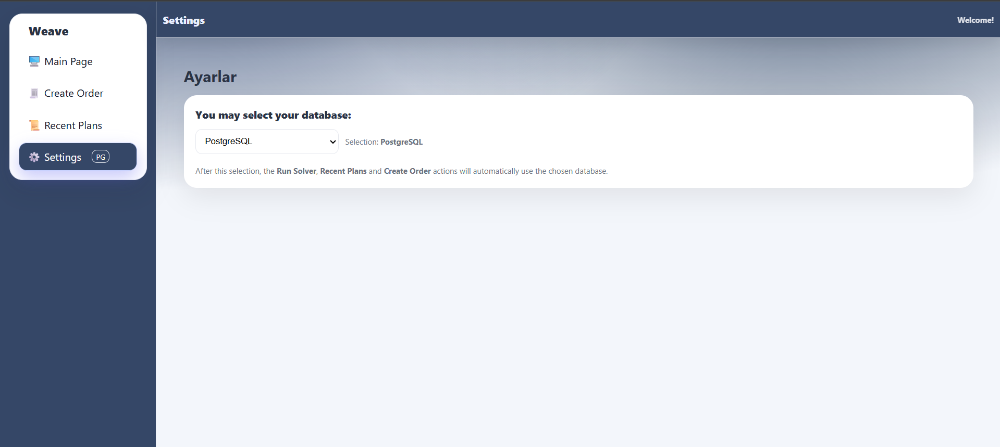

# Weave – Flexible Job Shop Scheduling System



## Overview

**Weave** is a decision support and optimization system designed to solve the **Flexible Job Shop Scheduling Problem (FJSP)** in advanced digital manufacturing.
It generates optimal production plans that minimize **makespan**, leveraging Google OR-Tools with a Hexagonal Architecture backend and a reactive Vue.js frontend.

The project was developed as an **internship project at ŞA-RA Enerji A.Ş.** (Jul 2025 - Aug 2025) by **Sude Kırlar**.

---

## Key Features

* **Multi-Source Data Integration** – supports PostgreSQL and MongoDB as input/output data sources.
* **Hexagonal Architecture** – Core (business logic) is fully decoupled from technologies.
* **Asynchronous Optimization** – Celery + Redis background workers ensure responsive UI.
* **Interactive Web UI** – Vue.js frontend with Plotly.js Gantt charts.
* **What-If Analysis** – lock tasks to specific machines/start times and re-solve.
* **Persistent Results** – every plan run is versioned and stored permanently.

---

## System Architecture

* **Frontend (Vue.js + Plotly.js):** User interface for starting solvers, monitoring runs, and visualizing Gantt charts.
* **Backend (Flask + Celery + OR-Tools):** Core optimization engine with REST APIs.
* **Databases (PostgreSQL, MongoDB, Redis):** Input/output storage and task queue broker.

The backend follows **Hexagonal Architecture (Ports & Adapters)** for testability and maintainability.

---

## Repository Structure

```
fjsm_project/
│
├── core/               # Core FJSP logic (technology-agnostic)
├── backend/             # Flask App + Celery
├── adapters/           # DB, solver, and logging adapters          
├── config/             # Settings and logging
├── assets/              # Documentation and screenshots
└── tests/              # Unit and integration tests
```

⚠️ **Note**: You also need to clone the **frontend repository** [`fjsm_project_frontend`](https://github.com/sudekirlar/fjsm_project_frontend) and run it alongside this backend.

---

## Installation

1. Clone this repository:

   ```bash
   git clone https://github.com/your-org/fjsm_project.git
   cd fjsm_project
   ```
   
⚠️ **Note**: You also need to clone the **frontend repository** [`fjsm_project_frontend`](https://github.com/sudekirlar/fjsm_project_frontend) and run it alongside this backend.

2. Set up the environment (Conda recommended):

   ```bash
   conda create -n fjsm_env python=3.10
   conda activate fjsm_env
   pip install -r requirements.txt
   ```

3. Configure database connections in `config/settings.py`.

4. Run the backend API:

   ```bash
   flask run
   ```

5. Start Celery workers:

   ```bash
   celery -A backend.celery_app worker -l info --pool=solo
   ```

---

## API Endpoints (examples)

* `POST /api/solver/start` – initiate a new plan
* `GET /api/solver/status/<run_id>` – check solver status
* `GET /api/plans/<run_id>/gantt` – fetch results for visualization
* `POST /api/orders` – create a new task

---

## Screenshots

Main Dashboard


Create Order Page


Recent Plans


Settings Page


---

## Core Technologies

* **Backend:** Python, Flask, Celery, Google OR-Tools, PostgreSQL, MongoDB, Redis
* **Frontend:** Vue.js, Plotly.js, SCSS
* **DevOps & Tools:** Conda, Git/GitHub

---

## License & Credits

* UI components adapted from [Creative Tim’s Argon Dashboard](https://github.com/creativetimofficial/argon-dashboard) (MIT License).

---

## Developer

* Sude Kırlar
